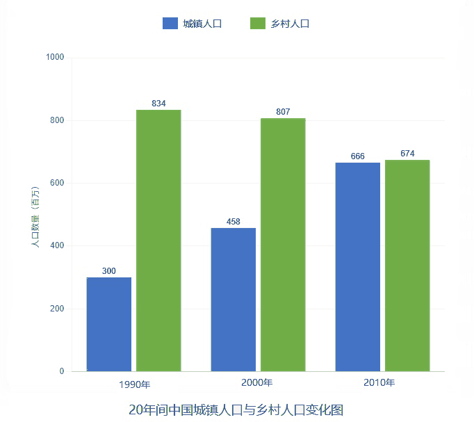

# 2014 · Part B：人口一升一降，解释靠条件，不编必然反超

## 这次先从图里确认什么

题目要求描述或解读图表，并给评论；本课先训练中文内容生成，不提前展开英文词句教学。

1990、2000、2010 年中国城镇与乡村人口，单位百万。城镇 300、458、666；乡村 834、807、674。2010 年两者接近，但城镇仍少于乡村；666 百万=6.66 亿。

来源：[公开题面整理](https://english-exam.lazynote.cn/kaoyan/sections/2014-english-two/section-iv-part-b/)与[图表来源](https://img-paper.lazynote.cn/2025/08/08/BuTgCR9C.jpg)。公开整理图或原卷截取的性质见[中文题库说明](../part-b-cn-papers.md)。原因与例子是合理展开，不是题面事实。

再次调用 [10b](./10b.md) 的两组端点变化、[11b](./11b.md) 的单位与推断边界。新增解释居住地选择，以及增长之后对公共服务的要求；不从 [13b](./13b.md) 的年级比较误带入没有时间的处理。

## 先让两组人口回到同一单位

标题给了人口和三年，图例给城镇与乡村。先照10b交代对象和时间，再取首尾；300百万是3亿，666百万是6.66亿。这里数的是人，可以写人口，不能沿用11b的市场份额；需要时直接用图上的百万单位，少做一次换算。

**这一处可以写：**

> 图表显示了 1990 至 2010 年中国城镇与乡村人口的变化。

> 城镇人口从 3 亿增加到 6.66 亿，乡村人口从 8.34 亿减少到 6.74 亿。

## 差距变小，不等于已经超过

最后城镇666、乡村674，前者还少8百万。看柱高接近时先比较数值，再说几乎接近；不能像10b那样看到增得快就顺手接反超。概括这一句只需要说差距缩小、仍略少，判断已够完整。

**这一处可以写：**

> 到 2010 年，两者之间的差距已很小，但城镇人口仍略少。

## 从人为什么换地方住找一句原因

先不说抽象的城镇化推动城镇化。问人去新地方做什么，最普通的是找工作；把城镇可能有更多机会写出来，再接能接触更多岗位。增加岗位是你选的解释，不是图表直接记录的事实，保留可能。

**这一处可以写：**

> 一种合理的解释是，城镇的就业机会可能吸引人们迁入。

> 到工作机会较多的地方居住，可以让劳动者接触更多岗位。

## 第二个条件也要落到选择动作

家庭住在哪还会考虑学校与公共服务，选这一个方向就够。接影响居住选择，再概括这些条件帮助人们寻找满足工作与日常需要的地方。不要只并列经济、教育、医疗三个名词；它们怎样影响居住，才是解释图中人口结构的关键。

**这一处可以写：**

> 教育和其他公共服务也可能影响家庭的居住选择。

> 这些条件共同作用，可能使家庭寻找能够满足工作与日常需要的居住地。

## 增长带来什么需要，结尾就处理什么

人口多了，住房、出行、上学都需要服务，所以建议对象是规划者。先说服务需求，再列具体事项并写它们支持日常生活。乡村人口虽然下降，仍有6.74亿，不能写乡村没有价值；末句回应两组居民，而不是预测哪一年必将反超。

**这一处可以写：**

> 我认为，城镇人口增长需要相应的公共服务。

> 规划者应改善住房、交通和学校，使人口增长得到可靠的日常服务支持。

> 乡村居民的需要也应受到重视，不能把城镇扩张当作唯一的成功指标。

> 更均衡的安排有助于使人口变化惠及更多家庭。

## 把刚才的句子组织成完整回答

第一段先让人看见图中关系，第二段解释这种关系，第三段给出由前文产生的评论。下面的中文按已审英文的段落与句序对应；单句教学中的解释可以更直白，但完整回答不临时增加别的论点。三段是这一批示范的组织选择，不是固定句数或评分加分项。

**第1段：图中事实。**

> 图表显示了 1990 至 2010 年中国城镇与乡村人口的变化。

> 城镇人口从 3 亿增加到 6.66 亿，乡村人口从 8.34 亿减少到 6.74 亿。

> 到 2010 年，两者之间的差距已很小，但城镇人口仍略少。

**第2段：解释与展开。**

> 一种合理的解释是，城镇的就业机会可能吸引人们迁入。

> 到工作机会较多的地方居住，可以让劳动者接触更多岗位。

> 教育和其他公共服务也可能影响家庭的居住选择。

> 这些条件共同作用，可能使家庭寻找能够满足工作与日常需要的居住地。

**第3段：评论与行动。**

> 我认为，城镇人口增长需要相应的公共服务。

> 规划者应改善住房、交通和学校，使人口增长得到可靠的日常服务支持。

> 乡村居民的需要也应受到重视，不能把城镇扩张当作唯一的成功指标。

> 更均衡的安排有助于使人口变化惠及更多家庭。

## 内容先到位，再向目标档次完善

**两组端点、百万单位和接近但未反超的关系必须准确；评论需回应人口变化。**

先写清一升一降及就业条件。完善时把条件接居住选择，再把增长接服务需求，并保留乡村居民，使解释和评价都覆盖图中的两组。 中文阶段先能独立产生这些关系；英语阶段才查语言多样性、准确性、150词篇幅和限时成文。目标为12/15与13—14/15，不能按中文是否漂亮直接判分；本题英文为162词，具体审核见下方链接。

## 换一处，自己接下一句

只用2010年666百万与674百万，写一句组间关系，再说为何不能沿用10b的“超过”。 先移开示范，用普通中文完成，不需要与原句同词。这里一次只练当前变化，不要求另写整篇腹稿。

写过以后，对照一种可行接法

> 2010 年城镇人口为 6.66 亿，乡村为 6.74 亿，两者已很接近。

> 但城镇人口仍略少，因此这里不能写城镇已经超过乡村。

接近与超过要分开。可以不计算差多少，只要方向和单位都正确。

本课保存了教学和示范，尚未收到你的首次输出，因此不记录已经教会。下一次先看这项小练习是否能独立完成；不会就补眼前一句，不再拿完整范文盖过你的实际缺口。

[本年中文对应稿](../part-b-cn-papers.md#2014) · [本年英文与质量审核](../part-b-score-audit.md#2014) · [Part B打法与复盘](../part-b-playbook.md)

[上一课：2013](./13b.md) · [从2010开始](./10b.md) · [下一课：2015](./15b.md)
