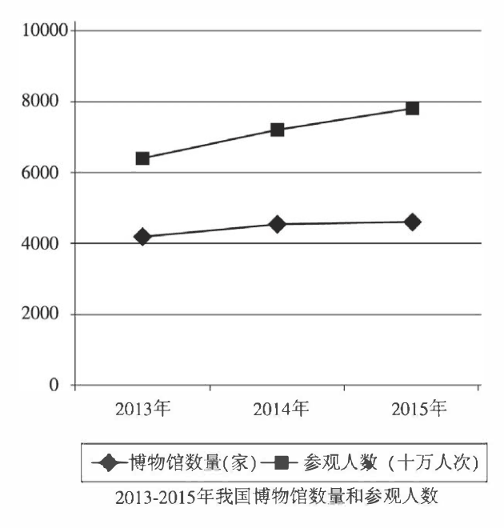

# 2017 · Part B：两条线一起上升，先核单位再谈关联

## 这次先从图里确认什么

题目要求描述或解读图表，并给评论；本课先训练中文内容生成，不提前展开英文词句教学。

2013—2015 年我国博物馆数量与参观人次。博物馆约 4200→4500→4700 家；参观量约 6400→7200→7800，图例单位“十万人次”，约合 6.4→7.2→7.8 亿人次。按刻度估读；人次不是独立人数。

来源：[仓库原卷，第15个PDF页面](../../archive-e2/2017年考研英语二真题.pdf)。公开整理图或原卷截取的性质见[中文题库说明](../part-b-cn-papers.md)。原因与例子是合理展开，不是题面事实。

复用 [10b](./10b.md)、[14b](./14b.md) 的两组时间变化与条件解释。这次新增不同单位的两条线：数量不能直接相减，参观人次也不能当成独立参观者；两者一起升不等于因果已被证明。

## 先分清两条线各数什么

一条数场馆，单位家；一条数参观，单位十万人次。6400个十万人次是6.4亿人次，不是6400人，也不是640万人。第一句同时说数量与人次，后面才不会拿一条线的数字去解释另一条线。

**这一处可以写：**

> 图表显示了 2013 至 2015 年我国博物馆数量与参观人次。

## 各写自己的变化，不直接比较高低

4200到4700和6.4亿到7.8亿，各自在自己的单位中比较首尾。图中参观线更高，不等于参观者比博物馆更重要；更不能将两种数量直接相减。现在只需要说两项都升，数字有估读误差就写约。

**这一处可以写：**

> 博物馆约从 4200 家增至 4700 家，参观量约从 6.4 亿增至 7.8 亿人次。

> 两项指标都上升，但它们衡量的是不同的事情。

## 解释从地点更方便找起

复用10b的服务可用条件，但这里不用负担手机费，改成能否方便到达场馆。更多场馆可能让人有就近选择；后一作用接到参观方便，一条理由就完成。没有票价信息时，不把所有场馆免费当作真题事实。

**这一处可以写：**

> 更多博物馆可能使参观地点更容易到达。

> 人们能够就近选择场馆时，参观就更方便。

## 再从参观能做什么补一条理由

博物馆有展品，可以将历史和生活讲得具体；先写这个动作，再举普通物件介绍过去生活的例子，接到参观者自己的经验。两线一起上升仍不能证明唯一原因，参观量也可能包括重复来访。例子是帮助解释吸引力的合理补充，不能声称图表记录了每家馆都办过这种展览。

**这一处可以写：**

> 展示历史和日常生活的展览，也可能使学习变得具体，并吸引参观者。

> 例如，用普通物件讲解过去生活方式的展览，可以将陌生的历史与参观者的生活经验联系起来。

> 两项共同上升提示文化参与扩大，但没有确定唯一原因；参观人次也可能包含同一个人的重复来访。

## 评论把数量接到参观质量

增长的价值是更多文化体验，但体验好不好要看介绍和安排。把谁做什么写成博物馆提供清楚介绍、方便安排，再接不同年龄的人理解展品。结尾不用再次报增长数字，而是指出数量如何更可能带来真实收获。

**这一处可以写：**

> 我认为，扩大文化服务是有价值的，但场馆数量需要与参观质量一起考虑。

> 博物馆应提供清楚的介绍和方便的参观安排，帮助不同年龄的人理解展品。

> 这样，更多人次才有机会转化为更有收获的文化体验。

## 把刚才的句子组织成完整回答

第一段先让人看见图中关系，第二段解释这种关系，第三段给出由前文产生的评论。下面的中文按已审英文的段落与句序对应；单句教学中的解释可以更直白，但完整回答不临时增加别的论点。三段是这一批示范的组织选择，不是固定句数或评分加分项。

**第1段：图中事实。**

> 图表显示了 2013 至 2015 年我国博物馆数量与参观人次。

> 博物馆约从 4200 家增至 4700 家，参观量约从 6.4 亿增至 7.8 亿人次。

> 两项指标都上升，但它们衡量的是不同的事情。

**第2段：解释与展开。**

> 更多博物馆可能使参观地点更容易到达。

> 人们能够就近选择场馆时，参观就更方便。

> 展示历史和日常生活的展览，也可能使学习变得具体，并吸引参观者。

> 例如，用普通物件讲解过去生活方式的展览，可以将陌生的历史与参观者的生活经验联系起来。

> 两项共同上升提示文化参与扩大，但没有确定唯一原因；参观人次也可能包含同一个人的重复来访。

**第3段：评论与行动。**

> 我认为，扩大文化服务是有价值的，但场馆数量需要与参观质量一起考虑。

> 博物馆应提供清楚的介绍和方便的参观安排，帮助不同年龄的人理解展品。

> 这样，更多人次才有机会转化为更有收获的文化体验。

## 内容先到位，再向目标档次完善

**两项各自的变化、十万人次换算与参观次数的性质必须保住；共同上升不当作唯一因果。**

先写两条趋势与就近选择这一理由。完善时加入展览的具体学习用途，区分关联和因果、人数和人次，并让评论落实到理解展品。 中文阶段先能独立产生这些关系；英语阶段才查语言多样性、准确性、150词篇幅和限时成文。目标为12/15与13—14/15，不能按中文是否漂亮直接判分；本题英文为161词，具体审核见下方链接。

## 换一处，自己接下一句

只根据两条线都上升，写一句可确认的关系，再写一句不能确认的因果。 先移开示范，用普通中文完成，不需要与原句同词。这里一次只练当前变化，不要求另写整篇腹稿。

写过以后，对照一种可行接法

> 2013 至 2015 年，博物馆数量和参观人次都增加了。

> 但图表不能证明参观增长完全由新增博物馆造成。

承认不能证明唯一原因，不等于证明新增博物馆没有作用；这两种判断要分开。

本课保存了教学和示范，尚未收到你的首次输出，因此不记录已经教会。下一次先看这项小练习是否能独立完成；不会就补眼前一句，不再拿完整范文盖过你的实际缺口。

[本年中文对应稿](../part-b-cn-papers.md#2017) · [本年英文与质量审核](../part-b-score-audit.md#2017) · [Part B打法与复盘](../part-b-playbook.md)

[上一课：2016](./16b.md) · [从2010开始](./10b.md) · [下一课：2018](./18b.md)
