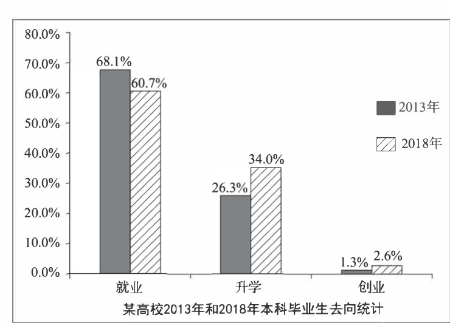

# 2019 · Part B：去向在变化，解释选择，不把升学当万能答案

## 这次先从图里确认什么

题目要求描述或解读图表，并给评论；本课先训练中文内容生成，不提前展开英文词句教学。

某高校2013、2018年本科毕业生去向：就业68.1%→60.7%，升学26.3%→34.0%，创业1.3%→2.6%。三项未合计100%，其余去向未展示。

来源：[仓库原卷，第15个PDF页面](../../archive-e2/2019年考研英语二真题.pdf)。公开整理图或原卷截取的性质见[中文题库说明](../part-b-cn-papers.md)。原因与例子是合理展开，不是题面事实。

复用[11b](./11b.md)的份额与总人数区分、[13b](./13b.md)的毕业准备、[15b](./15b.md)的用途。这次新增多条毕业路径：解释升学为什么更有吸引力，仍要保留就业是最大项。

## 先确定这次是谁去了哪里

是某高校本科毕业生的去向，两年为2013、2018。不能写全国青年失业率，因为图中没有全国和失业分类；没马上就业还可能是升学。第一句只交代该高校与两年，让描述范围稳住。

**这一处可以写：**

> 图表比较了某高校2013和2018年本科毕业生的去向。

## 最大项下降，另一项上升，两件事一起写

就业68.1%到60.7%仍最大；升学26.3%到34.0%是主要上升；创业1.3%到2.6%虽翻倍，仍是很小一项。先保留绝对份额关系，再概括更多比例去升学，避免只因翻倍就把创业写成主流。三项不满100%，不自行补出剩余类别。

**这一处可以写：**

> 就业仍是最大类别，但占比从68.1%降至60.7%。

> 升学从26.3%增至34.0%，创业从1.3%增至2.6%。

> 主要变化是，选择继续学习而不是立即就业的比例更高了。

## 从升学可以准备什么找一句理由

13b用兼职接工作经验，这里用进一步学习接更深入的专业训练。先说进入就业市场前深化知识，再接某些工作需要更深入知识；这样原因针对升学，而不是大学生很优秀这类评价。不要把没有工作可找写成调查确认的唯一原因。

**这一处可以写：**

> 一种可能的解释是，一些毕业生希望在进入就业市场之前深化知识。

> 继续学习可以为需要更深入专业知识的工作提供训练。

> 另一些人可能希望有更多时间了解自己的职业兴趣。

## 有用途，也不写成升学必然成功

探索职业兴趣可以是另一种准备。接着限制学历与合适工作之间的关系：额外学历不会自动保证工作，仍要有技能与符合实际的期待。这不是要求你在考场劝所有人不考研，而是让选择理由与结果条件分开。

**这一处可以写：**

> 因此，继续学习的吸引力可能体现准备的需要，但多一个学历并不会自动带来合适的工作。

> 技能与符合实际的期待仍然重要。

## 建议帮助作选择，不替所有人选同一条

学校可以提供成本、要求与目标的比较。先说明帮助比较，再让职业指导接学生真正想做的工作。最后写了解充分比跟随最大群体重要，回应多种路径；不以就业最多为由说所有人都应马上就业。

**这一处可以写：**

> 我认为，大学应帮助学生比较不同道路的成本和要求。

> 职业指导应将升学与实际目标联系起来，而不是把一条道路当作适合所有人。

> 作出了解充分的选择，比跟随人数最多的群体更重要。

## 把刚才的句子组织成完整回答

第一段先让人看见图中关系，第二段解释这种关系，第三段给出由前文产生的评论。下面的中文按已审英文的段落与句序对应；单句教学中的解释可以更直白，但完整回答不临时增加别的论点。三段是这一批示范的组织选择，不是固定句数或评分加分项。

**第1段：图中事实。**

> 图表比较了某高校2013和2018年本科毕业生的去向。

> 就业仍是最大类别，但占比从68.1%降至60.7%。

> 升学从26.3%增至34.0%，创业从1.3%增至2.6%。

> 主要变化是，选择继续学习而不是立即就业的比例更高了。

**第2段：解释与展开。**

> 一种可能的解释是，一些毕业生希望在进入就业市场之前深化知识。

> 继续学习可以为需要更深入专业知识的工作提供训练。

> 另一些人可能希望有更多时间了解自己的职业兴趣。

> 因此，继续学习的吸引力可能体现准备的需要，但多一个学历并不会自动带来合适的工作。

> 技能与符合实际的期待仍然重要。

**第3段：评论与行动。**

> 我认为，大学应帮助学生比较不同道路的成本和要求。

> 职业指导应将升学与实际目标联系起来，而不是把一条道路当作适合所有人。

> 作出了解充分的选择，比跟随人数最多的群体更重要。

## 内容先到位，再向目标档次完善

**就业仍最大、升学上升、创业较小且增长都需准确；份额不能直接推出就业人数下降。**

先准确描述去向并说明升学的训练用途。完善时把目标、费用和结果条件连起来，不把学历当作工作保证，也不把跟风当充分理由。 中文阶段先能独立产生这些关系；英语阶段才查语言多样性、准确性、150词篇幅和限时成文。目标为12/15与13—14/15，不能按中文是否漂亮直接判分；本题英文为166词，具体审核见下方链接。

## 换一处，自己接下一句

只根据就业68.1%→60.7%，写一句确定的变化，再写一句能否知道就业人数下降。 先移开示范，用普通中文完成，不需要与原句同词。这里一次只练当前变化，不要求另写整篇腹稿。

写过以后，对照一种可行接法

> 该高校毕业生中选择就业的比例从68.1%降至60.7%。

> 图表没有给出两年的毕业生总人数，因此不能仅凭比例确定就业人数下降。

比例下降是确定的，人数下降不是已知。这里复用11b的判断，不需要另背一种就业题结论。

本课保存了教学和示范，尚未收到你的首次输出，因此不记录已经教会。下一次先看这项小练习是否能独立完成；不会就补眼前一句，不再拿完整范文盖过你的实际缺口。

[本年中文对应稿](../part-b-cn-papers.md#2019) · [本年英文与质量审核](../part-b-score-audit.md#2019) · [Part B打法与复盘](../part-b-playbook.md)

[上一课：2018](./18b.md) · [从2010开始](./10b.md) · [下一课：2020](./20b.md)
