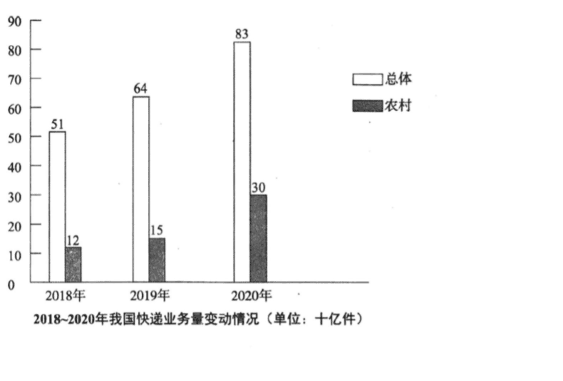

# 2022 · Part B：农村在全国之内，解释增长时不把两组相加

## 这次先从图里确认什么

题目要求描述或解读图表，并给评论；本课先训练中文内容生成，不提前展开英文词句教学。

2018—2020年我国快递业务量，单位十亿件：总体51、64、83；农村12、15、30。农村是总体中的部分，不能两者相加；全国业务量未说明利润。

来源：[仓库原卷，第15个PDF页面](../../archive-e2/2022年考研英语二真题.pdf)。公开整理图或原卷截取的性质见[中文题库说明](../part-b-cn-papers.md)。原因与例子是合理展开，不是题面事实。

复用[10b](./10b.md)的变化与可用条件、[17b](./17b.md)的数量单位核查。这次新增部分与总体：农村业务量属于全国总体，要同时报告变化，却不能相加算另一个总量。

## 先读单位，确认数的是件不是钱

2018至2020是时间轴，单位十亿件。先交代全国快递业务量，不能开头写行业收入增长；件数没有告诉你多少钱，更没有告诉你利润。51个十亿件是510亿件，中文也可以保留51十亿件，重点是与英文billion同量级。

**这一处可以写：**

> 图表显示了2018至2020年我国快递业务量，单位为十亿件。

## 各自首尾，中间一年用来确认趋势

总体51、64、83，农村12、15、30，都连续增长。用首尾说明幅度，中间年确认不是一路持平最后才增长；不用为每根柱另起一句。农村增长较快可以讨论，但不要把30与83相加得到113十亿件。

**这一处可以写：**

> 总体从510亿件增至830亿件，2019年为640亿件。

> 农村从120亿件增至300亿件，中间一年为150亿件。

> 农村业务量在增长的全国总体之内，不是需要额外加到总体上的数量。

## 先问哪件日常动作需要快递

网上下单后，货物要运到购买者手里。于是方便下单可以增加配送需求，句子从一个普通动作长出。这里说一种可能解释，不声称图表统计了全部包裹都来自网购，也不必查出平台名字和政策年份。

**这一处可以写：**

> 一种可能的解释是，方便的在线下单创造了配送需求。

## 农村这一组，从收发条件解释

有更广配送网络，家庭更容易收货，卖家更容易发货；接到跨距离联系买卖双方。一旦收发条件改善，农村生产者就可能接触本地以外顾客。先条件、再动作、再作用，比农村发展迅速这句空概括更能解释农村业务增加。

**这一处可以写：**

> 更广的农村配送网络，也可能让家庭收货和卖家发货更容易。

> 这些改变能跨越距离，连接买家与卖家。

> 对农村生产者来说，更容易使用配送服务，可能带来接触本地市场以外顾客的机会。

## 评论不要只要求更多包裹

件数增长的价值，最终在货物能否可靠到达。建议配送公司改善农村覆盖与处理质量，同时少用不必要包装，回应扩张带来的服务需要。最后把可靠到达与单纯多出垃圾对照；这是评价标准，不是声称调查已证明垃圾必然增长。

**这一处可以写：**

> 我认为，业务扩张应当伴随可靠服务。

> 快递公司应改善农村配送的可达性和处理质量，同时减少不必要的包装。

> 货物可靠到达人们手中时，更多包裹才有价值，而不是只增加垃圾和没有解决的问题。

## 把刚才的句子组织成完整回答

第一段先让人看见图中关系，第二段解释这种关系，第三段给出由前文产生的评论。下面的中文按已审英文的段落与句序对应；单句教学中的解释可以更直白，但完整回答不临时增加别的论点。三段是这一批示范的组织选择，不是固定句数或评分加分项。

**第1段：图中事实。**

> 图表显示了2018至2020年我国快递业务量，单位为十亿件。

> 总体从510亿件增至830亿件，2019年为640亿件。

> 农村从120亿件增至300亿件，中间一年为150亿件。

> 农村业务量在增长的全国总体之内，不是需要额外加到总体上的数量。

**第2段：解释与展开。**

> 一种可能的解释是，方便的在线下单创造了配送需求。

> 更广的农村配送网络，也可能让家庭收货和卖家发货更容易。

> 这些改变能跨越距离，连接买家与卖家。

> 对农村生产者来说，更容易使用配送服务，可能带来接触本地市场以外顾客的机会。

**第3段：评论与行动。**

> 我认为，业务扩张应当伴随可靠服务。

> 快递公司应改善农村配送的可达性和处理质量，同时减少不必要的包装。

> 货物可靠到达人们手中时，更多包裹才有价值，而不是只增加垃圾和没有解决的问题。

## 内容先到位，再向目标档次完善

**总体、农村及十亿件要对应正确；农村不能加在总体外，业务量不能写成收入或利润。**

先报告两组增长并解释网购需求。完善时将农村网络接收发便利、再接外地市场机会；评论由扩张产生可靠处理和包装条件。 中文阶段先能独立产生这些关系；英语阶段才查语言多样性、准确性、150词篇幅和限时成文。目标为12/15与13—14/15，不能按中文是否漂亮直接判分；本题英文为164词，具体审核见下方链接。

## 换一处，自己接下一句

只用2020年总体83、农村30十亿件，写一句关系，并判断能否说总量为113十亿件。 先移开示范，用普通中文完成，不需要与原句同词。这里一次只练当前变化，不要求另写整篇腹稿。

写过以后，对照一种可行接法

> 2020 年全国快递业务量为830亿件，其中农村为300亿件。

> 农村属于全国总体，所以不能把两者相加说成1130亿件。

其中说明包含关系。不能因为两根柱分开画，就把它们理解成两个互不重叠的地区。

本课保存了教学和示范，尚未收到你的首次输出，因此不记录已经教会。下一次先看这项小练习是否能独立完成；不会就补眼前一句，不再拿完整范文盖过你的实际缺口。

[本年中文对应稿](../part-b-cn-papers.md#2022) · [本年英文与质量审核](../part-b-score-audit.md#2022) · [Part B打法与复盘](../part-b-playbook.md)

[上一课：2021](./21b.md) · [从2010开始](./10b.md) · [下一课：2023](./23b.md)
