# Part B 大作文：2010—2026中文对应稿

本稿按[英文审核定稿](./part-b-score-audit.md)逐段逐句形成，三段及句序对应，不另增加中文独有的宏大论点。每句单独放在引用块，便于看出究竟要写什么；分段标记保留文章组织。先经英文成文与两轮自审，再形成中文，最后进入[cn/10b—26b](./cn/README.md#part-b大作文)的句子生成教学。

图表事实来自题面，原因、举例和建议是本项目新写的合理分析，不能冒充调查已经证明的事实。2016—2025核对仓库原卷；2010—2015采用公开题面和图表整理，原仓库尚没有这六套完整原卷；2026采用中国教育在线试题整理。图表数字优先于来源页范文，特别是2010的十亿单位和2026的四项数字。教材评分依据与目标说明放在英文稿中，不把中文译文单独评为12或14分。

每题需描述或解读图表并给评论；2010—2012不少于150词，2013—2026约150词，满分15分。英文定稿为154—171词。读中文时不必先练英文词句，考场也不要求先写一份中文腹稿再逐句翻译。

## 2010

**题目与图表。** 手机订阅量，2000—2008 年。发展中国家约从 0.3 十亿增至 4 十亿；发达国家约从 0.6 十亿增至 1 十亿。2003 年前后前者超过后者。柱高估读，使用约数；订阅量不等于独立使用人数。

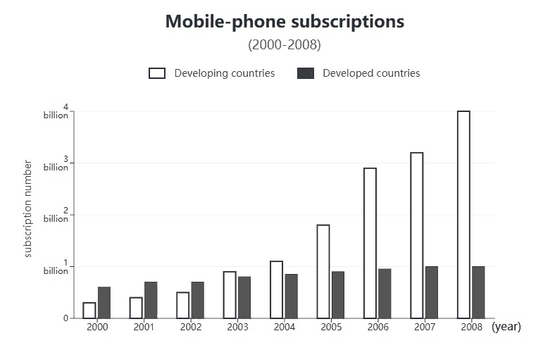

来源：[公开题面整理](https://english-exam.lazynote.cn/kaoyan/sections/2010-english-two/section-iv-part-b/)与[图表来源](https://img-paper.lazynote.cn/2025/08/08/nuTgr4Gm.jpg)。2010—2015为公开整理图，2016—2025为原卷截取，2026为试题整理截取；保留原图标题、数据、图例及必要注释。

**中文对应稿。**

**第1段：图中事实。**

> 图表比较了 2000 至 2008 年发展中国家与发达国家的手机订阅量。

> 发展中国家的数量约从 3 亿增至 40 亿，而发达国家仅约从 6 亿增至 10 亿。

> 发展中国家在 2003 年前后超过了发达国家，并成为增长的主要来源。

**第2段：解释与展开。**

> 一种可能的解释是，手机和通信服务更容易负担，使更多家庭能够使用它们。

> 人们需要联系家人和处理工作，这给新增订阅提供了实际用途。

> 相比之下，在服务已较普及的市场，新增订阅的空间可能更小。

> 扩大网络覆盖还可能使通信服务在更多地方可用，从而进一步支持需求。

**第3段：评论与行动。**

> 我认为，这种增长为更便利的通信创造了机会。

> 服务商应改善网络覆盖，同时使基本服务保持可负担。

> 衡量进步时，除了订阅数量，也应关注用户能否获得可靠服务。

**这篇怎样找到话。** 先写出增长差异和一条条件到结果的解释。再补另一组的不同条件，并让结尾回应可负担与可靠服务；内容质量提高在关系完整，不在把普通话换成宏大词。

**不能省略或偷换。** 两类国家、起止年份、数量单位与不同增长幅度都不能丢；描述和评论都要出现。

[逐句生成教学：10b](./cn/10b.md) · [英文定稿与逐题审核：154词](./part-b-score-audit.md#2010)

## 2011

**题目与图表。** 2008、2009 年国内轿车市场部分品牌份额。国产约 26%→31%，日系约 34%→26%，美系约 10%→10%。柱高估读，不把图外其他品牌漏项解释为零。

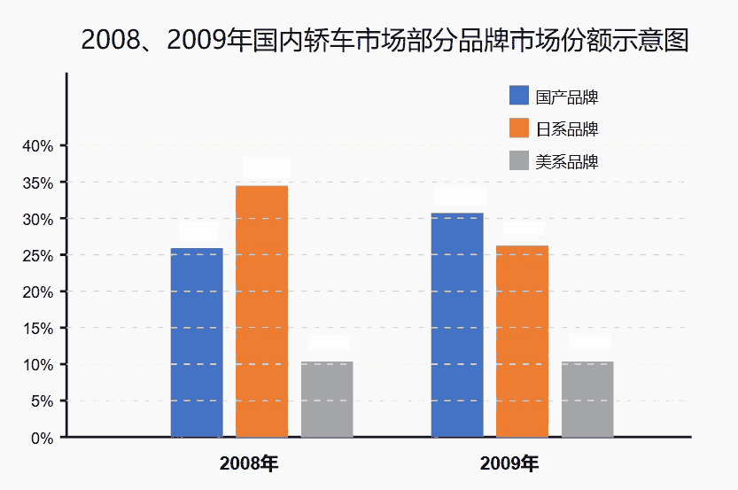

来源：[公开题面整理](https://english-exam.lazynote.cn/kaoyan/sections/2011-english-two/section-iv-part-b/)与[图表来源](https://img-paper.lazynote.cn/2025/08/08/uuTgE7yK.jpg)。2010—2015为公开整理图，2016—2025为原卷截取，2026为试题整理截取；保留原图标题、数据、图例及必要注释。

**中文对应稿。**

**第1段：图中事实。**

> 图表显示了 2008 和 2009 年国内轿车市场部分品牌的份额。

> 国产品牌约从 26% 升至 31%，日系约从 34% 降至 26%。

> 美系品牌则基本保持在 10% 左右。

> 国产在图示品牌中的位置上升，但份额本身不能说明总销量怎样变化。

**第2段：解释与展开。**

> 一种可能的解释是，国产汽车在质量和价格上的改进，使它们对购买者更有吸引力。

> 汽车是一项大开支，因此买家在作出决定前可能会比较实用性和长期费用。

> 当这些购买者改变选择时，品牌的市场份额就可能发生变化，即使整个市场还在扩大。

**第3段：评论与行动。**

> 我认为，赢得份额值得重视，但企业仍需要通过可靠产品和售后服务保持信任。

> 持续解决顾客的实际问题，比假定一次增长就代表长期成功更有用。

> 技术改进和及时的客户支持，能够给购买者再次选择企业产品的理由。

**这篇怎样找到话。** 起步保住三组方向并写一条购买条件。完善时把条件接购买选择，再接份额变化；加上对销量推断的限制，让结尾真正服务企业改进。

**不能省略或偷换。** 国产升、日系降、美系基本稳定都要交代；百分比是份额，不是销量。

[逐句生成教学：11b](./cn/11b.md) · [英文定稿与逐题审核：156词](./part-b-score-audit.md#2011)

## 2012

**题目与图表。** 某公司员工工作满意度调查。≤40 岁：满意 16.7%，不清楚 50.0%，不满意 33.3%；41—50 岁：0.0%、36.0%、64.0%；>50 岁：40.0%、50.0%、10.0%。没有历年数据；不清楚不等于满意。

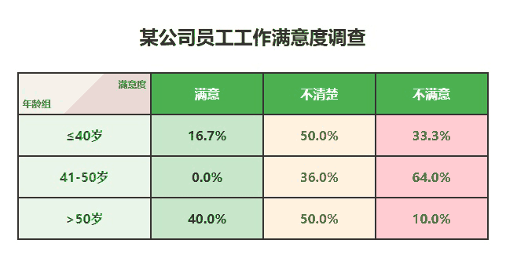

来源：[公开题面整理](https://english-exam.lazynote.cn/kaoyan/sections/2012-english-two/section-iv-part-b/)与[图表来源](https://img-paper.lazynote.cn/2025/08/08/SuTgDUsV.jpg)。2010—2015为公开整理图，2016—2025为原卷截取，2026为试题整理截取；保留原图标题、数据、图例及必要注释。

**中文对应稿。**

**第1段：图中事实。**

> 表格比较了某公司三个年龄组员工的工作满意度。

> 41 至 50 岁组的不满意比例最高，为 64%，满意比例为零。

> 50 岁以上组的满意比例最高，为 40%，只有 10% 不满意。

> 40 岁及以下组有一半回答不清楚，因此该组没有单一态度占多数。

**第2段：解释与展开。**

> 中间年龄组的不满可能与工作要求和晋升机会不清晰有关。

> 已经投入多年工作的人，可能更期待自己的付出得到认可。

> 相比之下，一些年长员工可能更看重工作稳定。

> 因此，同一种政策可能无法回应员工群体中的不同关切。

**第3段：评论与行动。**

> 我认为，公司应先听取员工意见，再决定哪些改变最有帮助。

> 更清楚的晋升条件和合理的工作量安排，可能有助于回应工作中的不满。

> 同时，公司应继续了解那些态度不明确的员工，而不把他们视作已经满意。

**这篇怎样找到话。** 先完成正确的两组对照。进一步把工作条件接具体期待，并针对未知原因提出听取意见；不靠给每个年龄段贴心理标签增加篇幅。

**不能省略或偷换。** 最大不满意组、最高满意组与不清楚类别都要分开；这不是满意度逐年变化图。

[逐句生成教学：12b](./cn/12b.md) · [英文定稿与逐题审核：159词](./part-b-score-audit.md#2012)

## 2013

**题目与图表。** 某高校学生兼职情况：大一 67.77%，大二 71.13%，大三 71.93%，大四 88.24%。横轴为年级，不是四个历年；没有跟踪同一批学生的说明。

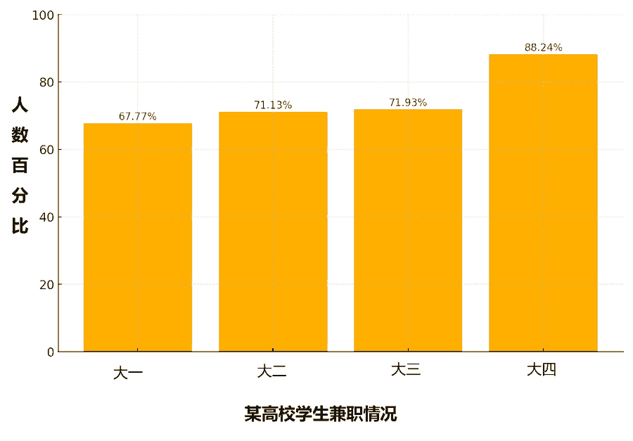

来源：[公开题面整理](https://english-exam.lazynote.cn/kaoyan/sections/2013-english-two/section-iv-part-b/)与[图表来源](https://img-paper.lazynote.cn/2025/08/08/6uTgD5CX.jpg)。2010—2015为公开整理图，2016—2025为原卷截取，2026为试题整理截取；保留原图标题、数据、图例及必要注释。

**中文对应稿。**

**第1段：图中事实。**

> 图表显示了某高校不同年级学生的兼职比例。

> 大一为 67.77%，大二和大三都约为 71% 至 72%。

> 大四达到 88.24%，明显高于其他年级。

> 整体上，高年级的兼职比例较高，大四尤其突出。

**第2段：解释与展开。**

> 一个可能的理由是，临近毕业的学生更希望积累工作经验。

> 兼职可以让他们了解实际工作要求，并在申请工作时提供具体经历。

> 另一些学生可能希望赚取生活费，这也使兼职具有直接用途。

> 对准备进入职场的学生来说，承担实际职责的兼职可能尤其有吸引力。

**第3段：评论与行动。**

> 我认为，安排得当的兼职可以补充大学学习。

> 学生应选择时间可控、能够学到东西的工作，同时保留足够的上课和复习时间。

> 这样，工作经历才能支持未来准备，而不会削弱当前学业。

**这篇怎样找到话。** 先有准确比例比较和临近毕业需要经验这条理由。进一步交代经验怎样用于工作申请，并给出时间条件，做到肯定的价值和限制彼此对应。

**不能省略或偷换。** 年级差异、大四突出与具体评论都要出现；不把不同年级写成同一批人的历年跟踪。

[逐句生成教学：13b](./cn/13b.md) · [英文定稿与逐题审核：154词](./part-b-score-audit.md#2013)

## 2014

**题目与图表。** 1990、2000、2010 年中国城镇与乡村人口，单位百万。城镇 300、458、666；乡村 834、807、674。2010 年两者接近，但城镇仍少于乡村；666 百万=6.66 亿。

来源：[公开题面整理](https://english-exam.lazynote.cn/kaoyan/sections/2014-english-two/section-iv-part-b/)与[图表来源](https://img-paper.lazynote.cn/2025/08/08/BuTgCR9C.jpg)。2010—2015为公开整理图，2016—2025为原卷截取，2026为试题整理截取；保留原图标题、数据、图例及必要注释。

**中文对应稿。**

**第1段：图中事实。**

> 图表显示了 1990 至 2010 年中国城镇与乡村人口的变化。

> 城镇人口从 3 亿增加到 6.66 亿，乡村人口从 8.34 亿减少到 6.74 亿。

> 到 2010 年，两者之间的差距已很小，但城镇人口仍略少。

**第2段：解释与展开。**

> 一种合理的解释是，城镇的就业机会可能吸引人们迁入。

> 到工作机会较多的地方居住，可以让劳动者接触更多岗位。

> 教育和其他公共服务也可能影响家庭的居住选择。

> 这些条件共同作用，可能使家庭寻找能够满足工作与日常需要的居住地。

**第3段：评论与行动。**

> 我认为，城镇人口增长需要相应的公共服务。

> 规划者应改善住房、交通和学校，使人口增长得到可靠的日常服务支持。

> 乡村居民的需要也应受到重视，不能把城镇扩张当作唯一的成功指标。

> 更均衡的安排有助于使人口变化惠及更多家庭。

**这篇怎样找到话。** 先写清一升一降及就业条件。完善时把条件接居住选择，再把增长接服务需求，并保留乡村居民，使解释和评价都覆盖图中的两组。

**不能省略或偷换。** 两组端点、百万单位和接近但未反超的关系必须准确；评论需回应人口变化。

[逐句生成教学：14b](./cn/14b.md) · [英文定稿与逐题审核：162词](./part-b-score-audit.md#2014)

## 2015

**题目与图表。** 我国某市居民春节假期花销比例：新年礼物 40%，交通 20%，聚会吃饭 20%，其他 20%。图中没有年度比较，也没有总花费金额。

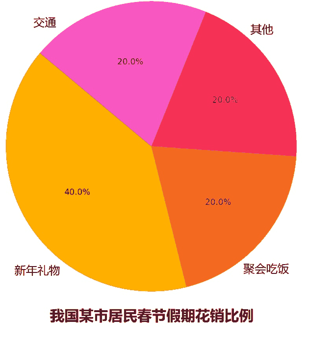

来源：[公开题面整理](https://english-exam.lazynote.cn/kaoyan/sections/2015-english-two/section-iv-part-b/)与[图表来源](https://img-paper.lazynote.cn/2025/08/08/0uTgB15q.jpg)。2010—2015为公开整理图，2016—2025为原卷截取，2026为试题整理截取；保留原图标题、数据、图例及必要注释。

**中文对应稿。**

**第1段：图中事实。**

> 饼图展示了我国某市居民春节假期的花销结构。

> 新年礼物占 40%，是最大的单项。

> 交通、聚会吃饭和其他花销各占 20%，均为礼物支出比例的一半。

> 图表说明了钱花在哪些方面，但没有说明总共花了多少钱。

**第2段：解释与展开。**

> 这种结构可能与春节期间走亲访友的习惯有关。

> 送礼可以表达关心，而见面和一起吃饭也需要交通与餐饮支出。

> 因此，这些花销可能既服务于实际出行，也服务于人们维持关系的需要。

> 较大的礼物份额本身并不能证明居民在浪费钱。

**第3段：评论与行动。**

> 我认为，节日花销应支持团聚，同时保持在家庭能够负担的范围内。

> 居民可以提前设定预算，选择合适的礼物，而不是把价格当作关心程度的标准。

> 这样，人们能够享受节日，也能减少本可避免的经济压力。

**这篇怎样找到话。** 先用两句完成最大与相同关系，再从花销类别找实际用途。完善时区分大份额与浪费，并让预算建议处理可负担条件。

**不能省略或偷换。** 礼物单项最大、其余三项相等与占比性质必须准确；没有增长数据，不写消费逐年上升。

[逐句生成教学：15b](./cn/15b.md) · [英文定稿与逐题审核：156词](./part-b-score-audit.md#2015)

## 2016

**题目与图表。** 某高校学生旅游目的调查：欣赏风景 37%，缓解压力 33%，广交朋友 9%，培养独立能力 6%，其他 15%。没有历年变化，也没有说明旅游实际效果。

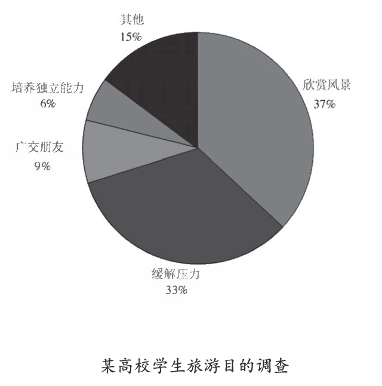

来源：[仓库原卷，第15个PDF页面](../archive-e2/2016年考研英语二真题.pdf)。2010—2015为公开整理图，2016—2025为原卷截取，2026为试题整理截取；保留原图标题、数据、图例及必要注释。

**中文对应稿。**

**第1段：图中事实。**

> 图表显示了某高校学生的旅游目的。

> 欣赏风景占 37%，缓解压力占 33%，是最常见的两项。

> 广交朋友和培养独立能力分别为 9% 和 6%，其他目的占 15%。

> 与社交和独立能力相比，这些学生更常将旅游与观景和放松联系起来。

**第2段：解释与展开。**

> 一种可能的解释是，日常学习使学生希望换一个环境。

> 参观陌生地方能提供不同于课堂的体验，而暂时离开日常任务也可能有助于放松。

> 较少学生把独立能力列为主要目的，并不意味着旅行不能锻炼计划能力。

> 调查记录的是目的，而不是旅行后的实际效果。

**第3段：评论与行动。**

> 我认为，旅行可以兼顾放松与学习。

> 学生可以选择符合预算的路线，并自己安排交通和时间。

> 这样既能享受风景，也能练习处理实际问题，而不必把每次旅行变成新的压力来源。

**这篇怎样找到话。** 先完整说明两项主要目的，并解释换环境怎样满足它们。完善时识别目的与效果的边界，再通过自己安排行程接独立性，使评论有具体行动。

**不能省略或偷换。** 目的、两项主要占比和较低项要对应正确；不能把选择目的的比例当成能力或实际效果。

[逐句生成教学：16b](./cn/16b.md) · [英文定稿与逐题审核：157词](./part-b-score-audit.md#2016)

## 2017

**题目与图表。** 2013—2015 年我国博物馆数量与参观人次。博物馆约 4200→4500→4700 家；参观量约 6400→7200→7800，图例单位“十万人次”，约合 6.4→7.2→7.8 亿人次。按刻度估读；人次不是独立人数。

来源：[仓库原卷，第15个PDF页面](../archive-e2/2017年考研英语二真题.pdf)。2010—2015为公开整理图，2016—2025为原卷截取，2026为试题整理截取；保留原图标题、数据、图例及必要注释。

**中文对应稿。**

**第1段：图中事实。**

> 图表显示了 2013 至 2015 年我国博物馆数量与参观人次。

> 博物馆约从 4200 家增至 4700 家，参观量约从 6.4 亿增至 7.8 亿人次。

> 两项指标都上升，但它们衡量的是不同的事情。

**第2段：解释与展开。**

> 更多博物馆可能使参观地点更容易到达。

> 人们能够就近选择场馆时，参观就更方便。

> 展示历史和日常生活的展览，也可能使学习变得具体，并吸引参观者。

> 例如，用普通物件讲解过去生活方式的展览，可以将陌生的历史与参观者的生活经验联系起来。

> 两项共同上升提示文化参与扩大，但没有确定唯一原因；参观人次也可能包含同一个人的重复来访。

**第3段：评论与行动。**

> 我认为，扩大文化服务是有价值的，但场馆数量需要与参观质量一起考虑。

> 博物馆应提供清楚的介绍和方便的参观安排，帮助不同年龄的人理解展品。

> 这样，更多人次才有机会转化为更有收获的文化体验。

**这篇怎样找到话。** 先写两条趋势与就近选择这一理由。完善时加入展览的具体学习用途，区分关联和因果、人数和人次，并让评论落实到理解展品。

**不能省略或偷换。** 两项各自的变化、十万人次换算与参观次数的性质必须保住；共同上升不当作唯一因果。

[逐句生成教学：17b](./cn/17b.md) · [英文定稿与逐题审核：161词](./part-b-score-audit.md#2017)

## 2018

**题目与图表。** 2017 年某市消费者选择餐厅时的关注因素：特色 36.3%，服务 26.8%，环境 23.8%，价格 8.4%，其他 4.7%。

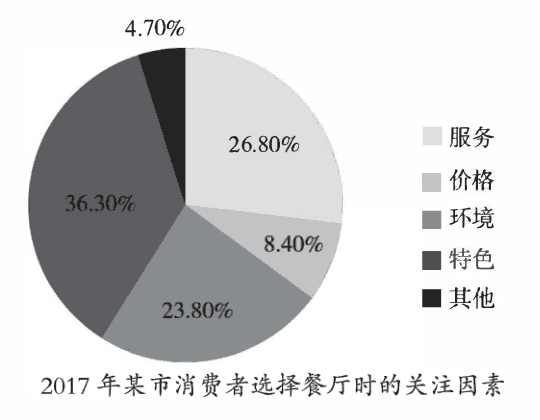

来源：[仓库原卷，第15个PDF页面](../archive-e2/2018年考研英语二真题.pdf)。2010—2015为公开整理图，2016—2025为原卷截取，2026为试题整理截取；保留原图标题、数据、图例及必要注释。

**中文对应稿。**

**第1段：图中事实。**

> 图表显示了2017年某市消费者选择餐厅时考虑的因素。

> 特色占36.3%，其次是服务26.8%和环境23.8%。

> 价格占8.4%，其他因素占4.7%。

> 这种分布表明，就餐体验比价格本身受到更多关注。

**第2段：解释与展开。**

> 一种可能的解释是，消费者希望获得在家中普通一餐不易得到的体验。

> 有特色的菜品给他们选择某家餐厅的理由。

> 周到的服务和舒适的环境，也能使一起吃饭更愉快。

> 但是，价格占比较小，不意味着顾客预算无限，也不意味着价格从不影响决定。

**第3段：评论与行动。**

> 我认为，餐厅应开发有特色的菜品，同时保持可靠的服务和舒适的环境。

> 价格也应清楚、合理。

> 体验值得付出的费用时，餐厅才能赢得长期信任，而不能只依靠新奇。

**这篇怎样找到话。** 先说最高项和一种独特体验。完善时让菜品、服务、环境共同解释选择，再将价格接体验是否值得，而不是只说餐厅应该提高质量。

**不能省略或偷换。** 五项因素和最高项准确；没有变化数据不写上升，价格小份额不写预算无限。

[逐句生成教学：18b](./cn/18b.md) · [英文定稿与逐题审核：157词](./part-b-score-audit.md#2018)

## 2019

**题目与图表。** 某高校2013、2018年本科毕业生去向：就业68.1%→60.7%，升学26.3%→34.0%，创业1.3%→2.6%。三项未合计100%，其余去向未展示。

来源：[仓库原卷，第15个PDF页面](../archive-e2/2019年考研英语二真题.pdf)。2010—2015为公开整理图，2016—2025为原卷截取，2026为试题整理截取；保留原图标题、数据、图例及必要注释。

**中文对应稿。**

**第1段：图中事实。**

> 图表比较了某高校2013和2018年本科毕业生的去向。

> 就业仍是最大类别，但占比从68.1%降至60.7%。

> 升学从26.3%增至34.0%，创业从1.3%增至2.6%。

> 主要变化是，选择继续学习而不是立即就业的比例更高了。

**第2段：解释与展开。**

> 一种可能的解释是，一些毕业生希望在进入就业市场之前深化知识。

> 继续学习可以为需要更深入专业知识的工作提供训练。

> 另一些人可能希望有更多时间了解自己的职业兴趣。

> 因此，继续学习的吸引力可能体现准备的需要，但多一个学历并不会自动带来合适的工作。

> 技能与符合实际的期待仍然重要。

**第3段：评论与行动。**

> 我认为，大学应帮助学生比较不同道路的成本和要求。

> 职业指导应将升学与实际目标联系起来，而不是把一条道路当作适合所有人。

> 作出了解充分的选择，比跟随人数最多的群体更重要。

**这篇怎样找到话。** 先准确描述去向并说明升学的训练用途。完善时把目标、费用和结果条件连起来，不把学历当作工作保证，也不把跟风当充分理由。

**不能省略或偷换。** 就业仍最大、升学上升、创业较小且增长都需准确；份额不能直接推出就业人数下降。

[逐句生成教学：19b](./cn/19b.md) · [英文定稿与逐题审核：166词](./part-b-score-audit.md#2019)

## 2020

**题目与图表。** 某高校学生手机阅读目的：学习知识59.5%，消磨时间21.3%，获取信息17.0%，其他2.2%。

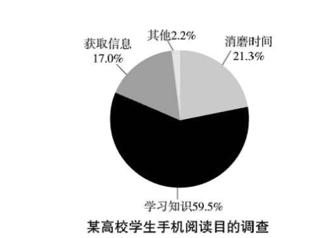

来源：[仓库原卷，第15个PDF页面](../archive-e2/2020年考研英语二真题.pdf)。2010—2015为公开整理图，2016—2025为原卷截取，2026为试题整理截取；保留原图标题、数据、图例及必要注释。

**中文对应稿。**

**第1段：图中事实。**

> 图表展示了某高校学生使用手机阅读的目的。

> 学习知识占59.5%，其次是消磨时间21.3%和获取信息17.0%。

> 其他目的占2.2%。

> 在这项调查中，学习知识显然是主要目的，而不只是娱乐。

**第2段：解释与展开。**

> 一种可能的解释是，手机让学生能在短暂休息时方便地接触阅读材料。

> 他们不必携带额外书本，就能阅读课程内容的讲解。

> 新闻和其他更新也能帮助他们迅速获取信息，而随意阅读可以消磨空闲时间。

> 但是，这些目的没有说明学生读得多认真，也没有说明实际学会了多少。

**第3段：评论与行动。**

> 我认为，选择可靠来源，并给值得读的材料足够注意时，手机阅读是有用的。

> 学生可以保存重要段落，以后再复看，而不是只从一页不断转到另一页。

> 方便获取内容应当支持理解，不能被当作理解本身。

**这篇怎样找到话。** 先描述知识多数与手机便携这一条件。完善时写材料如何服务知识或信息需要，再给注意、可靠来源与复看动作，使评论回应效果尚未确定的问题。

**不能省略或偷换。** 知识、信息、消磨时间分类正确；手机阅读目的不能冒充实际学习效果或全部手机行为。

[逐句生成教学：20b](./cn/20b.md) · [英文定稿与逐题审核：158词](./part-b-score-audit.md#2020)

## 2021

**题目与图表。** 某市居民锻炼方式：自己锻炼54.3%，和朋友一起47.7%，和家人一起23.9%，团体活动15.8%。合计141.7%，不应当作互斥整体；原图未交代完整问卷选项规则。

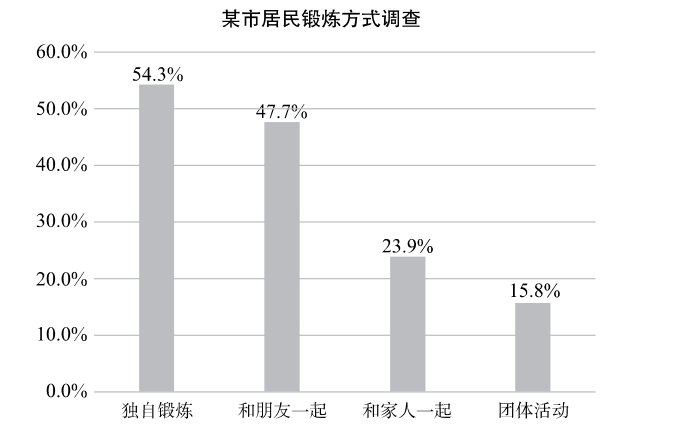

来源：[仓库原卷，第15个PDF页面](../archive-e2/2021年考研英语二真题.pdf)。2010—2015为公开整理图，2016—2025为原卷截取，2026为试题整理截取；保留原图标题、数据、图例及必要注释。

**中文对应稿。**

**第1段：图中事实。**

> 图表显示了某市居民的锻炼方式。

> 54.3%报告自己锻炼，47.7%和朋友一起锻炼。

> 和家人一起、参加团体活动分别为23.9%和15.8%。

> 这些比例相加超过100%，所以不应把它们当作同一个整体中相互排斥的份额。

**第2段：解释与展开。**

> 自己锻炼可能有吸引力，因为人们能够选择自己的时间和节奏。

> 和朋友一起锻炼能提供鼓励，使人更容易保持规律。

> 一个人可以在不同日子采用不同安排，这与图中的比例相容。

> 多种灵活安排可能帮助居民把锻炼融入日常生活。

**第3段：评论与行动。**

> 我认为，城市应为个人和共同锻炼提供便于使用的场所。

> 灵活的开放时间可以服务独立使用者，自愿参加的团体时段则能帮助喜欢有人陪伴的人。

> 提供实际可行的选择，比要求每个居民以同一种方式锻炼更有用。

**这篇怎样找到话。** 先写准四项及非互斥关系。完善时让两种常见安排各有具体作用，再把城市提供的选择分别接回自主与陪伴需要。

**不能省略或偷换。** 比例不能当互斥份额，也不能把自己锻炼当作排斥社交；两项主要方式与建议均需展开。

[逐句生成教学：21b](./cn/21b.md) · [英文定稿与逐题审核：161词](./part-b-score-audit.md#2021)

## 2022

**题目与图表。** 2018—2020年我国快递业务量，单位十亿件：总体51、64、83；农村12、15、30。农村是总体中的部分，不能两者相加；全国业务量未说明利润。

来源：[仓库原卷，第15个PDF页面](../archive-e2/2022年考研英语二真题.pdf)。2010—2015为公开整理图，2016—2025为原卷截取，2026为试题整理截取；保留原图标题、数据、图例及必要注释。

**中文对应稿。**

**第1段：图中事实。**

> 图表显示了2018至2020年我国快递业务量，单位为十亿件。

> 总体从510亿件增至830亿件，2019年为640亿件。

> 农村从120亿件增至300亿件，中间一年为150亿件。

> 农村业务量在增长的全国总体之内，不是需要额外加到总体上的数量。

**第2段：解释与展开。**

> 一种可能的解释是，方便的在线下单创造了配送需求。

> 更广的农村配送网络，也可能让家庭收货和卖家发货更容易。

> 这些改变能跨越距离，连接买家与卖家。

> 对农村生产者来说，更容易使用配送服务，可能带来接触本地市场以外顾客的机会。

**第3段：评论与行动。**

> 我认为，业务扩张应当伴随可靠服务。

> 快递公司应改善农村配送的可达性和处理质量，同时减少不必要的包装。

> 货物可靠到达人们手中时，更多包裹才有价值，而不是只增加垃圾和没有解决的问题。

**这篇怎样找到话。** 先报告两组增长并解释网购需求。完善时将农村网络接收发便利、再接外地市场机会；评论由扩张产生可靠处理和包装条件。

**不能省略或偷换。** 总体、农村及十亿件要对应正确；农村不能加在总体外，业务量不能写成收入或利润。

[逐句生成教学：22b](./cn/22b.md) · [英文定稿与逐题审核：164词](./part-b-score-audit.md#2022)

## 2023

**题目与图表。** 2012—2021年我国居民健康素养水平，百分比依次8.80、9.48、9.79、10.25、11.58、14.18、17.06、19.17、23.15、25.40。人群15—69岁城乡居民；指标指具备获取、理解与使用基本健康信息和服务能力的人所占比例。

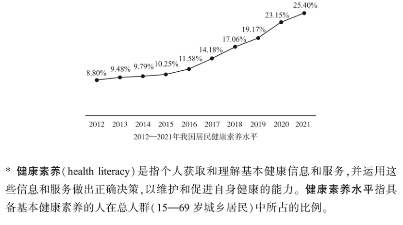

来源：[仓库原卷，第15个PDF页面](../archive-e2/2023年考研英语二真题.pdf)。2010—2015为公开整理图，2016—2025为原卷截取，2026为试题整理截取；保留原图标题、数据、图例及必要注释。

**中文对应稿。**

**第1段：图中事实。**

> 图表显示了2012至2021年我国15至69岁居民的健康素养水平。

> 比例从8.80%增至25.40%，后几年增长更快。

> 健康素养涉及人们获取、理解和使用基本健康信息及服务的能力。

> 图表衡量的是这种能力，不是没有疾病的人所占的比例。

**第2段：解释与展开。**

> 一种可能的解释是，易于获取的健康信息和教育，帮助更多人作出了解充分的决定。

> 清楚的指导能够说明怎样使用健康服务、怎样评估日常选择。

> 反复接触容易理解的信息，可能加强这些能力。

> 不过，比例上升不等于每个人都能识别可靠建议；最后的数字仍只约为所覆盖人群的四分之一。

**第3段：评论与行动。**

> 我认为，健康教育应保持实用、容易理解。

> 公共服务可以提供清楚讲解，以及检查信息来源的方法。

> 人们能在真实决定中运用所学时，进步才最有意义。

**这篇怎样找到话。** 先准确说增长与指标定义。完善时把清楚的信息接实际选择，说明尚未普及，再给核查来源和运用能力的建议；提升靠定义贯穿论证。

**不能省略或偷换。** 定义、15至69岁范围、端点及增长准确；健康素养不写成身体健康率，25.4%不写成大多数。

[逐句生成教学：23b](./cn/23b.md) · [英文定稿与逐题审核：163词](./part-b-score-audit.md#2023)

## 2024

**题目与图表。** 某高校劳动实践课学生主要收获：提升动手能力84.8%，学习相关知识91.3%，增强合作能力32.6%，感到心情舒畅54.4%。比例合计超过100%，各项是报告该收获的比例。

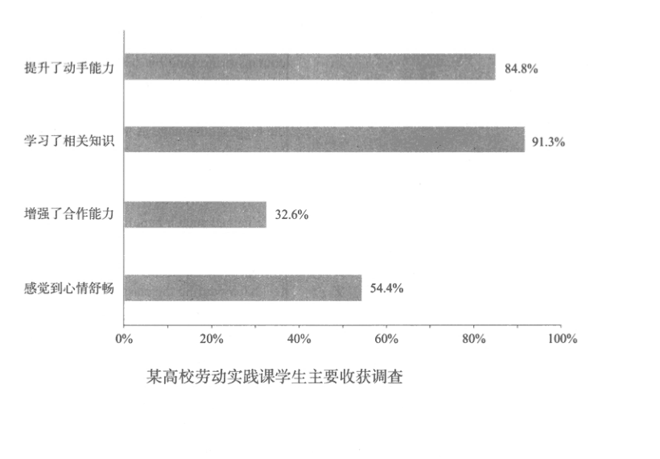

来源：[仓库原卷，第15个PDF页面](../archive-e2/2024年考研英语二真题.pdf)。2010—2015为公开整理图，2016—2025为原卷截取，2026为试题整理截取；保留原图标题、数据、图例及必要注释。

**中文对应稿。**

**第1段：图中事实。**

> 图表报告了某高校学生从劳动实践课获得的主要收获。

> 91.3%报告学到了相关知识，84.8%报告提升了动手能力。

> 54.4%报告心情更舒畅，32.6%报告合作能力增强。

> 知识与动手能力是最常报告的收获，但这些数字不是同一个整体中的互斥部分。

**第2段：解释与展开。**

> 一种可能的解释是，实践任务将想法与可以观察到的结果联系起来。

> 学生亲自使用一种方法时，能够看到什么有效，并纠正错误。

> 这可能同时支持知识与动手能力。

> 但合作可能不只是大家在同一处工作：学生需要共同任务和相互协调的机会。

> 缺少这种互动时，一项任务可能较少提供让学生觉察合作进步的机会。

**第3段：评论与行动。**

> 我认为，这些课程应保留实践任务，同时为团队合作提供更明确的角色和反馈。

> 学生可以一起讨论决定、回看结果。

> 这些安排可能让学习超越个人完成任务，同时不把报告比例最低的收获当作完全不存在。

**这篇怎样找到话。** 先有高低对照和亲自试方法这一解释。完善时把合作需要的协调条件写清，再由条件给角色、讨论和反馈，避免只加一句应该加强合作。

**不能省略或偷换。** 四项收获与报告比例准确，非互斥；合作低不等于没有合作，报告不能冒充实测增幅。

[逐句生成教学：24b](./cn/24b.md) · [英文定稿与逐题审核：171词](./part-b-score-audit.md#2024)

## 2025

**题目与图表。** 某社区老年人主要日常休闲活动：看电视90.8%，散步68.3%，养花34.7%，阅读31.8%，下棋18.4%。合计244%，非互斥份额；无历年对比。

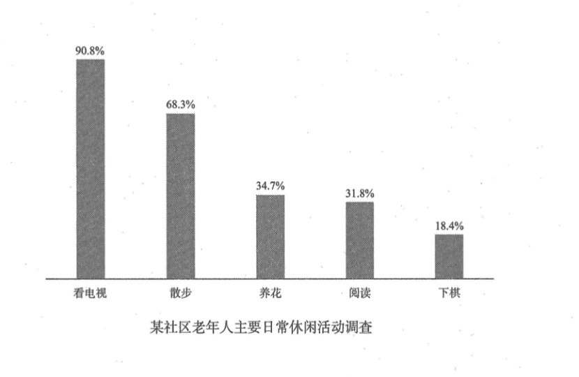

来源：[仓库原卷，第15个PDF页面](../archive-e2/2025年考研英语二真题.pdf)。2010—2015为公开整理图，2016—2025为原卷截取，2026为试题整理截取；保留原图标题、数据、图例及必要注释。

**中文对应稿。**

**第1段：图中事实。**

> 图表显示了某社区老年人主要的日常休闲活动。

> 90.8%报告看电视，其次是散步68.3%。

> 养花、阅读、下棋分别为34.7%、31.8%、18.4%。

> 看电视和散步是最常见的活动。

> 这些比例不应当作互斥类别，因为居民可能参加多种活动。

**第2段：解释与展开。**

> 看电视可能受欢迎，因为它在家中容易进行，且不需要很大体力。

> 散步提供了活动身体、在附近见到其他人的简单方式。

> 较少见的活动，可能更多依赖具体兴趣、合适场地或可一起参与的伙伴。

> 这种多样分布提示，休闲服务应容纳不同需要，而不要求所有人参加同一种活动。

**第3段：评论与行动。**

> 我认为，社区应支持多种选择，而不是批评老年人偏爱电视。

> 安全的步行路线、舒适的阅读场所和可以下棋的地方，能够扩大参与机会。

> 不同兴趣和能力的居民都应便于参加这些活动。

**这篇怎样找到话。** 先准确写常见项及电视便利、散步作用。完善时分析其他活动的参与条件，并给具体机会；评价支持选择，不用高低份额给人贴标签。

**不能省略或偷换。** 五项与非互斥关系准确；活动人数比例不写成时间比例，没有历年不写增长或退化。

[逐句生成教学：25b](./cn/25b.md) · [英文定稿与逐题审核：164词](./part-b-score-audit.md#2025)

## 2026

**题目与图表。** 某项关于儿童户外活动看法的调查：满足好奇心54.6%，促进观察力54.5%，强身健体37.2%，增强亲子互动33.2%。合计179.5%，不是互斥份额；标题没有把受访者限定为家长。

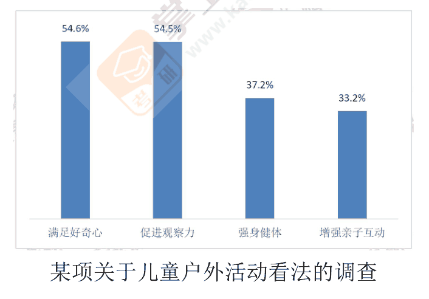

来源：[中国教育在线试题整理，第22个PDF页面](https://static.kaoyan.cn/file/question/2025/12/27/73ddc93ef0849e1c5809476a040e9eec.pdf)。2010—2015为公开整理图，2016—2025为原卷截取，2026为试题整理截取；保留原图标题、数据、图例及必要注释。

**中文对应稿。**

**第1段：图中事实。**

> 图表展示了人们对儿童户外活动的看法。

> 满足好奇心和促进观察力分别被54.6%和54.5%的受访者选择。

> 强身健体为37.2%，增强亲子互动为33.2%。

> 在这项调查中，探索和观察比强身健体、家庭互动更常被认作益处。

**第2段：解释与展开。**

> 一种可能的解释是，户外环境给儿童提供了能够直接探究的事物。

> 观察植物或昆虫可以带来提问与细致观察，使这些益处容易被注意到。

> 运动和与成人共同度过时间也有价值，即使选择它们的受访者较少。

> 调查涉及人们感受到的益处，因此这些比例不应被当作儿童能力实际改善的幅度。

**第3段：评论与行动。**

> 我认为，户外活动应提供探索、运动和交流的机会。

> 成人可以让儿童提问，参加适合的游戏，并讨论自己发现了什么。

> 这将学习与身体活动、共同经历结合起来，而不把户外时间缩成只有一个目的。

**这篇怎样找到话。** 先写两组对照和植物昆虫这一解释。完善时将观察对象接提问与观察的作用，保留运动互动价值，再用具体动作兼顾不同益处。

**不能省略或偷换。** 四项数据、两高两低、调查是看法都准确；不把认同比例写成能力增幅或所有受访者的身份。

[逐句生成教学：26b](./cn/26b.md) · [英文定稿与逐题审核：157词](./part-b-score-audit.md#2026)
